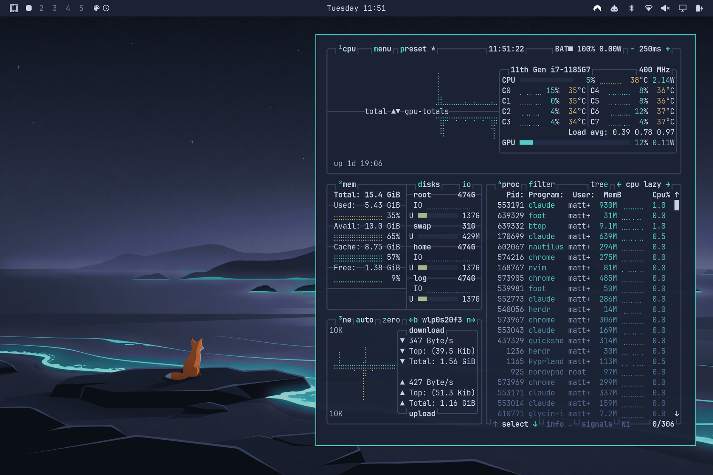
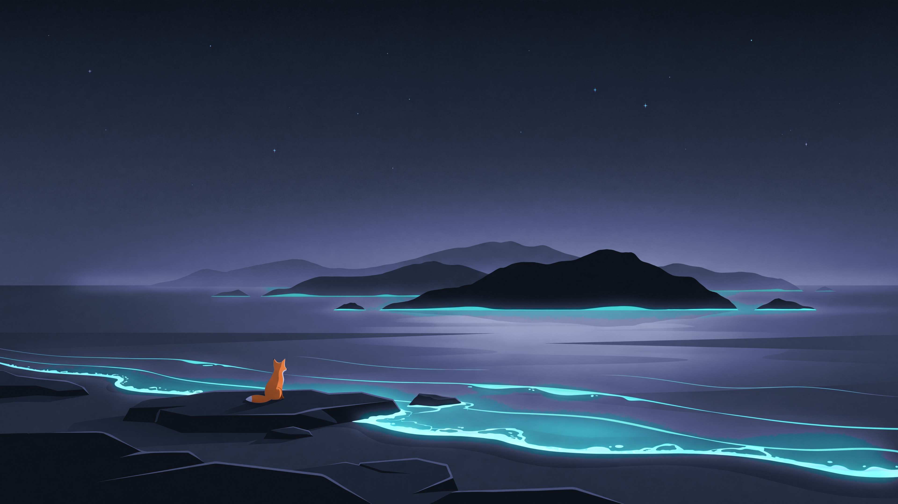
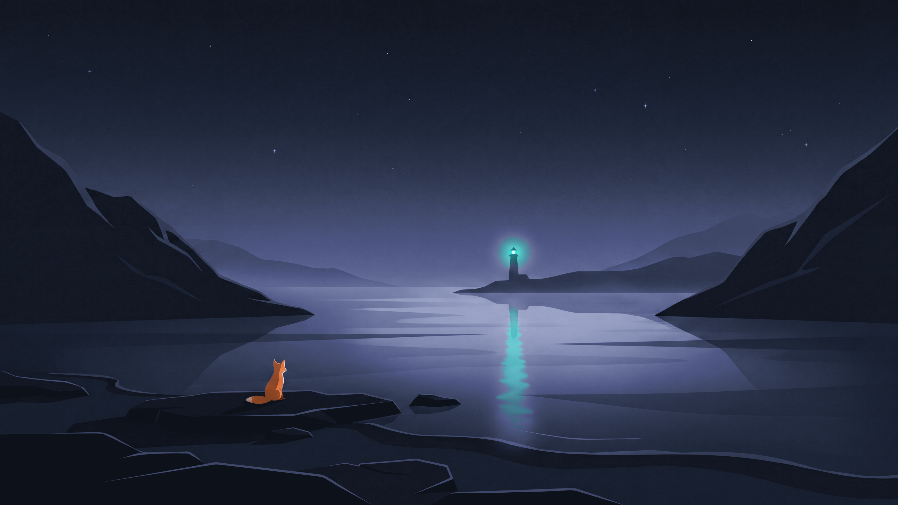

# fuchsblau · omarchy theme

> The stage, ready to play. One token palette, one border color,
> one lock screen — and nothing beyond that.

A dark-only theme for [Omarchy](https://omarchy.org) **Quattro** (>= 4.0),
built from restraint: one stage (`#1a2234`), three counted accents — teal,
fuchs, accent-mut. Since 4.0, Omarchy generates every app config
(terminals, btop, neovim, the whole shell, Hyprland, ...) from
`colors.toml`; this theme ships only tokens plus the few overrides where
the doctrine decides more than colors.



## Install

```sh
omarchy theme install https://github.com/fuchsblau/omarchy-fuchsblau-theme
omarchy theme set fuchsblau
```

## Backgrounds — the fuchslicht series

One night, one fox, three places. Three flat-illustration night scenes:
a bioluminescent **coast** (default), an aurora **ridge**, and a **fjord**
with a single lighthouse. The fox's orange (`#f0a060`) is the only warm
point in each image; teal (`#4dd6c8`) appears only as light. Cycle with
`Super + Ctrl + Space`.

| coast | ridge | fjord |
|---|---|---|
|  |  |  |

## What the theme ships

| File | Required? | Source |
|---|---|---|
| `colors.toml` | yes | charter · semantic Quattro tokens |
| `backgrounds/` | yes | the fuchslicht series |
| `icons.theme` | yes | `Yaru-blue` (matched hue) |
| `unlock.png` + previews | yes | lock-screen signet, switcher previews |
| `btop.theme` | override | gradient ends on fuchs · never magenta |
| `hyprland.lua` | override | 1px border, teal active / accent-mut inactive; gaps 8/16, rounding 0, no shadow |
| `shell.*.toml` | override | hairline frames (`#3a4360`) for OSD/popups, tooltips, menu, launcher |

Everything else (Alacritty/Foot/Kitty/Ghostty, Helix, Neovim via aether,
VS Code, Chromium, keyboard RGB, the entire shell — bar, menus,
notifications, OSD, polkit, lock) is generated by Omarchy from
`colors.toml` and therefore on-brand by construction.

## Deliberately unstyled (Quattro defaults)

These surfaces are new in Quattro and intentionally run on the generated
defaults. Touching them requires an ADR:

- **Shell sections without override**: `[bar]`, `[notifications]`,
  `[polkit]`, `[lock]`, `[image-picker]`, `[controls]`, `[font]`,
  `[spacing]`. Structural cards (menu, launcher, tooltips, OSD) carry the
  hairline frame from `shell.*.toml`; everything that *speaks* —
  notifications, lock states, polkit — deliberately keeps the teal
  Hyprland border: structure = hairline, active = teal.
- **`keyboard.rgb` / `chromium.theme`**: the generated values match the
  previously hand-maintained ones — files removed.
- **Neovim**: the generated aether.nvim spec replaces catppuccin-mocha
  with palette overrides — same intent (all tokens from `colors.toml`),
  no hand-maintained layer in between.

## Charter deviations

1. **5 extra ANSI hues.** Red, green, magenta plus bright variants. The
   terminal protocol is non-negotiable; without these slots every diff and
   highlight becomes unreadable. They are clamped to L≈0.78 C≈0.09 in
   oklch — same lightness and chroma as teal/fuchs — so the three counted
   accents stay recognizable to the eye.
2. **`brown` = fuchs −50 %.** The aether slot demands a brown; it is
   derived from the only sanctioned warm color instead of opening a new
   hue.

*Abandoned with Quattro:* the teal terminal cursor from v0.2. Omarchy now
pins the cursor system-wide to `bright_foreground`; overriding it would
cost four hand-maintained terminal configs — the opposite of restraint.

## Extra: GTK apps (Files & co.)

Omarchy 4 generates no GTK CSS — GNOME apps only roughly follow the theme
via Adwaita-dark. To put Files & co. token-exact on the stage, install the
bundled user template (works for *all* themes, not just fuchsblau):

```sh
cp extras/gtk.css.tpl ~/.config/omarchy/themed/
ln -sf ~/.local/state/omarchy/current/theme/gtk.css ~/.config/gtk-3.0/gtk.css
ln -sf ~/.local/state/omarchy/current/theme/gtk.css ~/.config/gtk-4.0/gtk.css
omarchy theme refresh && nautilus -q
```

GTK apps read the CSS only at startup; restart running apps once.

## License & attribution

MIT — see [`LICENSE`](LICENSE). © 2026 Matthias Nitsch.

- `icons.theme` references the **Yaru** icon set (Ubuntu/Canonical) —
  CC-BY-SA / GPL.
- `backgrounds/0..2` — the **fuchslicht** series — are AI-generated
  (Google Nano Banana Pro, `gemini-3-pro-image`) and graded onto the
  charter ramp. Briefing and full prompts are documented in
  [`docs/`](docs/) (German). As purely AI-generated images they are
  effectively public domain and not covered by this repo's MIT license.

---

*A dark-only Omarchy theme: one stage (`#1a2234`), three counted accents —
teal, fuchs, accent-mut.*
